# FT108A — Guia de estudo: classificação (modo 3Blue1Brown)

Material para **entender** os conceitos da lista — não para colar respostas.  
**Não resolve** as questões numéricas (Tabelas 1/2) nem a Tarefa 3 (Liver/MLP).

> **Como ler:** cada seção segue o ritmo 3b1b — (1) uma imagem mental, (2) um exemplo minúsculo que você consegue calcular na mão, (3) a fórmula como *resumo* da ideia, (4) o vídeo Manim.  
> Preview clássico (`Cmd+Shift+V`) renderiza math/imagens/vídeo melhor que o preview nativo do Cursor.

Animações: [`figures/manim/`](figures/manim/) · Estáticos: [`figures/`](figures/)

---

## Sumário

1. [Viés × variância](#1-viés--variância-a-flecha-que-erra-de-jeitos-diferentes)
2. [Naïve Bayes](#2-naïve-bayes-multiplicar-pistas-como-se-fossem-independentes)
3. [Entropia e ganho de informação](#3-entropia-e-ganho-de-informação-quanto-surpresa-ainda-resta)
4. [Árvores e poda](#4-árvores-e-poda-quando-parar-de-perguntar)
5. [Matriz de confusão e acurácia](#5-matriz-de-confusão-e-acurácia-o-placar-do-classificador)
6. [k-NN e escala](#6-k-nn-e-escala-vizinhos-num-espaço-distorcido)
7. [MLP — forward](#7-mlp--forward-empilhar-cortes-suaves)
8. [Gap treino × teste](#8-gap-treino--teste-o-modelo-decorou-ou-aprendeu)
9. [Ensemble (voto)](#9-ensemble--voto-majoritário-democracia-entre-modelos)
10. [Checklist rápido](#10-checklist-rápido-antes-da-prova)

---

## 1. Viés × variância: a flecha que erra de jeitos diferentes

### Imagem mental

Você treina vários modelos em **amostras diferentes** do mesmo problema e olha onde as previsões caem, em média, perto da verdade.

- **Viés (bias):** a média das previsões está **sistematicamente deslocada** da função real. O modelo “não consegue” representar o padrão (hipótese rígida demais).
- **Variância (variance):** as previsões **pulam muito** de uma amostra de treino para outra. O modelo é sensível demais ao ruído daquela amostra.
- **Ruído irredutível:** parte do erro que nenhum modelo remove (o mundo é barulhento).

Esquematicamente:

$$
\mathrm{Erro}_{\text{esperado}} \approx \mathrm{Bias}^2 + \mathrm{Variance} + \text{ruído}.
$$

### Dois extremos (o “U” do teste)

| Regime | O que o modelo faz | Treino | Teste | Em uma frase |
| --- | --- | --- | --- | --- |
| **Underfitting** | corta com uma régua onde a verdade é curva | ruim | ruim | viés alto |
| **Bom equilíbrio** | captura a forma sem perseguir cada ponto | bom | próximo do treino | compromisso |
| **Overfitting** | passa por (quase) todos os pontos de treino | ótimo | piora | variância alta |

À medida que a **complexidade** sobe: erro de treino tende a cair; erro de **teste** forma um **U** — primeiro melhora, depois piora.

**Pergunta Feynman (pra si):** “Meu modelo está errando porque é burro demais (viés) ou porque decorou a amostra (variância)?”

<video src="figures/manim/BiasVariance.mp4" controls width="720"></video>

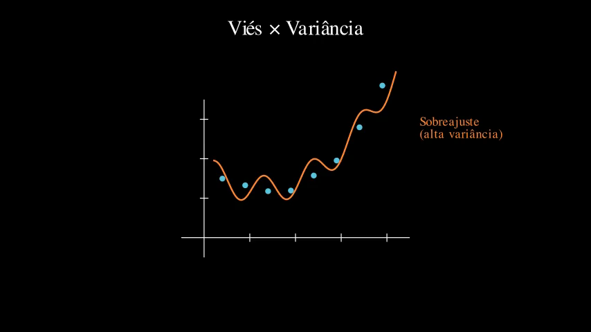

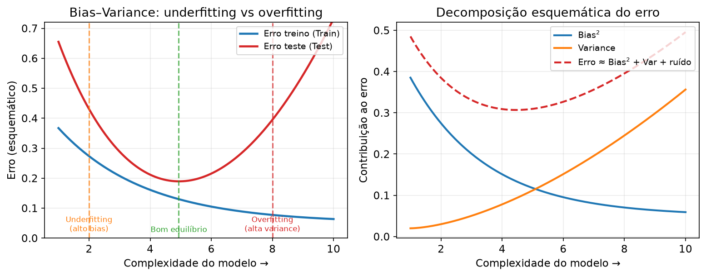

---

## 2. Naïve Bayes: multiplicar pistas como se fossem independentes

### Imagem mental

Você quer $P(\text{classe}\mid\text{evidências})$. Bayes diz: comece com o quanto a classe é comum **a priori**, e atualize com o quanto essas evidências são típicas **nessa** classe.

$$
P(y\mid\mathbf{x}) = \frac{P(\mathbf{x}\mid y)\,P(y)}{P(\mathbf{x})}.
$$

Na prática classificamos com

$$
\hat{y} = \arg\max_y \; P(y\mid\mathbf{x}) \propto P(y)\,P(\mathbf{x}\mid y),
$$

porque $P(\mathbf{x})$ não muda quem ganha o $\arg\max$.

### O “naïve”

Estimar $P(\mathbf{x}\mid y)$ completo é pesado (o vetor $\mathbf{x}$ vive em um espaço combinatório enorme). A hipótese **ingenua**:

$$
P(\mathbf{x}\mid y) = \prod_{j=1}^{d} P(x_j\mid y).
$$

“Dado a classe, as features se comportam como se fossem independentes.” Isso quase nunca é literalmente verdade — mas transforma o produto em pedaços estimáveis (contagens ou densidades univariadas).

### Exemplo minúsculo (inventado — não é a Tabela 1)

Duas classes, uma feature binária “febre” ∈ {sim, não}.

- Prior: $P(D)=0{,}3$, $P(S)=0{,}7$ (Doente / Saudável).
- Likelihood: $P(\text{febre}={\rm sim}\mid D)=0{,}8$, $P(\text{febre}={\rm sim}\mid S)=0{,}1$.

Paciente com febre:

$$
\begin{align*}
P(D\mid\text{febre}) &\propto 0{,}3\cdot 0{,}8 = 0{,}24, \\
P(S\mid\text{febre}) &\propto 0{,}7\cdot 0{,}1 = 0{,}07.
\end{align*}
$$

Normalizando: $0{,}24/(0{,}24+0{,}07)\approx 0{,}77$ para Doente.  
**Essência:** prior puxa; likelihood empurra; o produto decide.

Com várias features, você **multiplica** mais termos $P(x_j\mid y)$ (e usa log-soma para estabilidade numérica).

<video src="figures/manim/NaiveBayesProduct.mp4" controls width="720"></video>

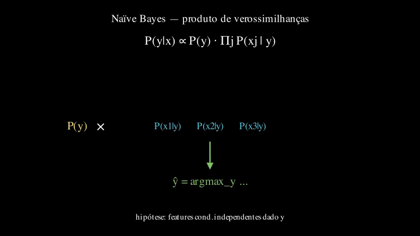

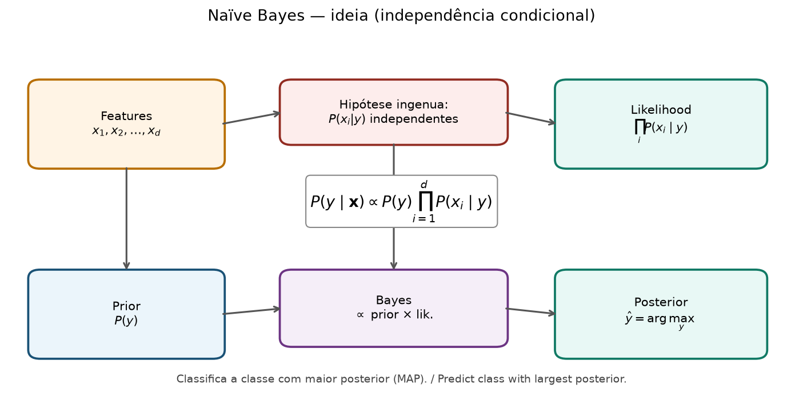

---

## 3. Entropia e ganho de informação: quanto “surpresa” ainda resta

### Imagem mental

Um saco com bolas de classes. Se **todas** são da mesma classe, tirar uma bola **não surpreende** — impureza zero. Se metade/metade, máxima incerteza.

### Entropia de Shannon (em bits, $\log_2$)

Se a fração da classe $k$ no nó é $p_k$:

$$
H = -\sum_k p_k \log_2 p_k.
$$

Por que o menos e o log?

- $\log_2(1/p)$ mede “surpresa” de um evento raro (quanto menor $p$, maior a surpresa).
- Multiplicar por $p$ e somar = **surpresa média**.
- O sinal negativo faz $H\ge 0$ porque $\log_2 p_k \le 0$ para $p_k\in(0,1]$.

**Casos-limite:**

- Uma classe só: $p=1$, $H=0$.
- Duas classes 50/50: $H=1$ bit.

### Exemplo minúsculo (inventado)

Nó com 4 exemplos: 3 da classe A, 1 da B.

$$
p_A=\tfrac{3}{4},\; p_B=\tfrac{1}{4},\quad
H = -\tfrac{3}{4}\log_2\tfrac{3}{4} - \tfrac{1}{4}\log_2\tfrac{1}{4}.
$$

Calcule no papel (é o tipo de conta que a lista pede em espírito). Ordem de grandeza: entre 0 e 1, mais perto de 0,8 do que de 0.

### Ganho de informação = quanto a pergunta “limpa” o saco

Você escolhe um atributo $A$ e parte o nó em filhos $S_v$. A entropia **esperada depois do split** é a média ponderada das entropias dos filhos:

$$
H_{\text{depois}}(A) = \sum_v \frac{|S_v|}{|S|} H(S_v).
$$

O **ganho**:

$$
\mathrm{IG}(A) = H(\text{pai}) - H_{\text{depois}}(A).
$$

**Essência 3b1b:** o melhor primeiro split é o que **mais reduz a surpresa média**. Árvores guloso-escolhem $\arg\max_A \mathrm{IG}(A)$ (ou usam Gini — mesma ideia de impureza).

<video src="figures/manim/EntropyGain.mp4" controls width="720"></video>

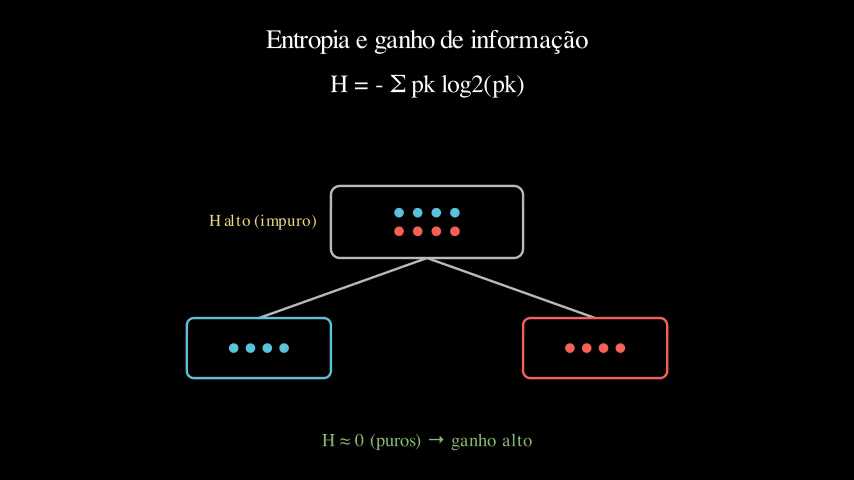

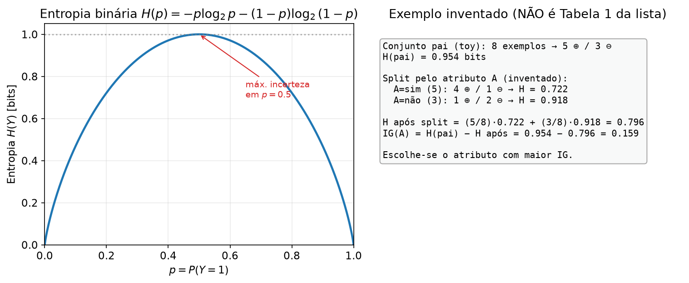

---

## 4. Árvores e poda: quando parar de perguntar

### Imagem mental

Cada pergunta (split) corta o espaço de features em regiões. Folhas demais = regiões minúsculas que memorizam **ruído** da amostra.

### Por que podar?

- **Pré-poda:** não deixa a árvore crescer (mínimo de exemplos na folha, profundidade máxima, ganho mínimo).
- **Pós-poda:** cresce e depois corta ramos que não ajudam em **validação** (ou com critério custo-complexidade).

Você aceita um pouco mais de erro no **treino** para reduzir variância e melhorar o **teste**.

**Ligação com §1:** árvore profunda ≈ baixa viés / alta variância; poda ≈ voltar um pouco no eixo complexidade.

<video src="figures/manim/TreePrune.mp4" controls width="720"></video>

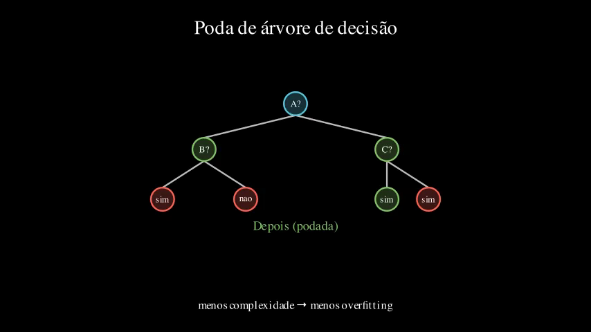

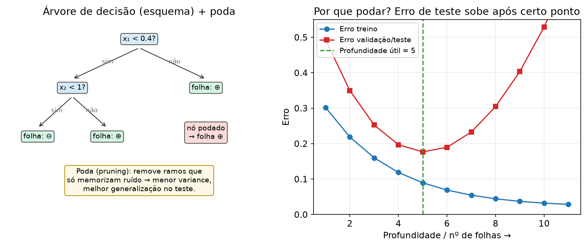

---

## 5. Matriz de confusão e acurácia: o placar do classificador

### Imagem mental

Linhas = verdade; colunas = o que o modelo chutou (ou o contrário — **fixe a convenção** e não misture).

Para duas classes:

|  | Predito − | Predito + |
| --- | --- | --- |
| Real − | TN | FP |
| Real + | FN | TP |

$$
\mathrm{Acurácia} = \frac{TP+TN}{TP+TN+FP+FN}.
$$

**Erro de classificação** (como na Tarefa 2) $= 1 - \mathrm{acurácia}$.

### Exemplo minúsculo (inventado)

10 exemplos: acertos 7 → acurácia $0{,}7$, erro $0{,}3$.  
Uma acurácia alta **não** prova que o classificador é “bom” se as classes forem desbalanceadas (chamear sempre a maioria). Por isso a lista pede discussão, não só o número.

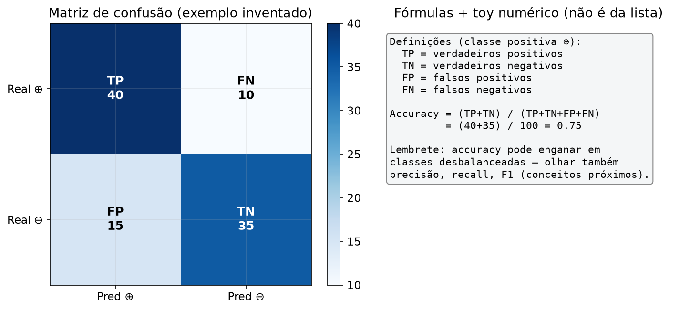

---

## 6. k-NN e escala: vizinhos num espaço distorcido

### Imagem mental

k-NN não “treina pesos”: na hora de classificar, mede distância até os pontos de treino e consulta os $k$ mais próximos.

Distância euclidiana:

$$
d(\mathbf{x},\mathbf{z}) = \sqrt{\sum_{j=1}^{d} (x_j - z_j)^2}.
$$

### O truque geométrico (3b1b)

Se a feature $j$ varia de $0$ a $3000$ e a feature $\ell$ de $0$ a $1$, o termo $(x_j-z_j)^2$ **engole** o resto. O “espaço” fica esticado num eixo — os vizinhos deixam de ser vizinhos semânticos e viram vizinhos do eixo dominante.

**Remédio:** padronizar ($z$-score) ou min-max **com estatísticas do treino**, depois aplicar no teste.

**Feynman:** “k-NN é tão honesto quanto a régua que você usa; se a régua é torta, a vizinhança é mentira.”

<video src="figures/manim/KNNScale.mp4" controls width="720"></video>

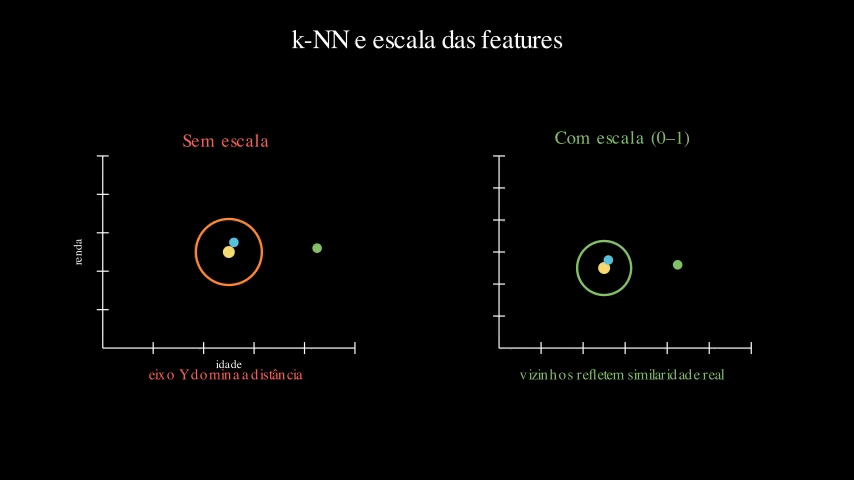

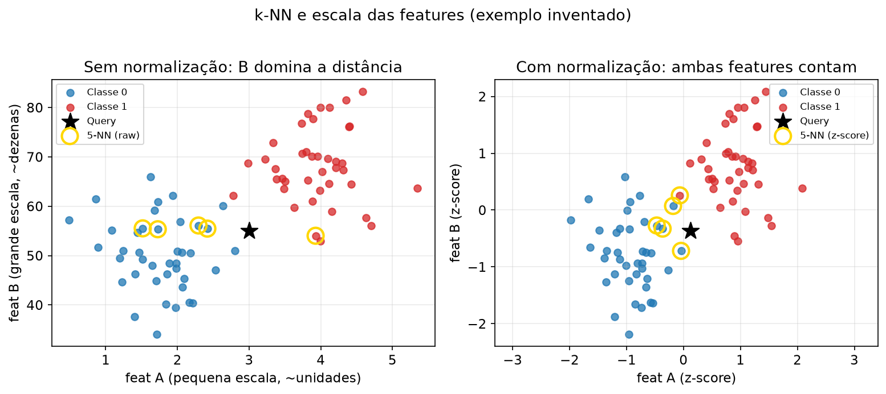

---

## 7. MLP — forward: empilhar cortes suaves

### Imagem mental

Um neurônio linear faz $z=\mathbf{w}\cdot\mathbf{x}+b$ (um hiperplano). A **ativação** $\sigma(z)$ transforma o lado do hiperplano numa intensidade suave (ex. sigmoide em $(0,1)$).

Uma **camada** = vários neurônios em paralelo → várias direções.  
A **próxima** camada não vê $\mathbf{x}$: vê o vetor de ativações. Ela desenha hiperplanos **no espaço já transformado**. Composição de mapas suaves → fronteira **não linear** no espaço original.

### Forward (uma oculta)

$$
\mathbf{a}^{(1)} = \sigma\!\big(X W^{(1)} + \mathbf{b}^{(1)}\big),
\qquad
\hat{y} = \sigma\!\big(\mathbf{a}^{(1)} W^{(2)} + b^{(2)}\big).
$$

### Contagem de pesos (treino mental — espírito da Q7)

Entradas $d$, ocultos $H$ (com bias), 1 saída (com bias):

$$
\#\text{pesos} = \underbrace{d\cdot H + H}_{\text{camada 1}} + \underbrace{H\cdot 1 + 1}_{\text{camada 2}} = H(d+1)+(H+1).
$$

Para $d=5$, $H=10$: calcule. (É aritmética — faça sem calculadora.)

### Pré-processamento típico (MLP)

- Numéricos: escala (senão a sigmoide satura e o gradiente some).
- Categóricos: one-hot / embeddings (a rede não “lê” strings).
- Alvo: binário $\{0,1\}$ ou one-hot multiclasse.

**Backprop (só a essência):** a loss diz o quão errado está $\hat{y}$; a regra da cadeia espalha esse “puxão” para cada peso. Detalhe operacional → notebook `mlp_scratch.ipynb`.

<video src="figures/manim/MLPForward.mp4" controls width="720"></video>

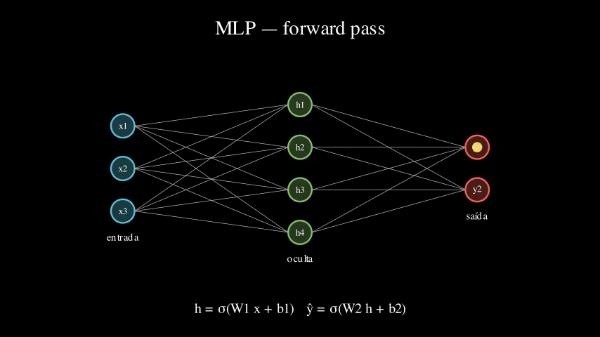

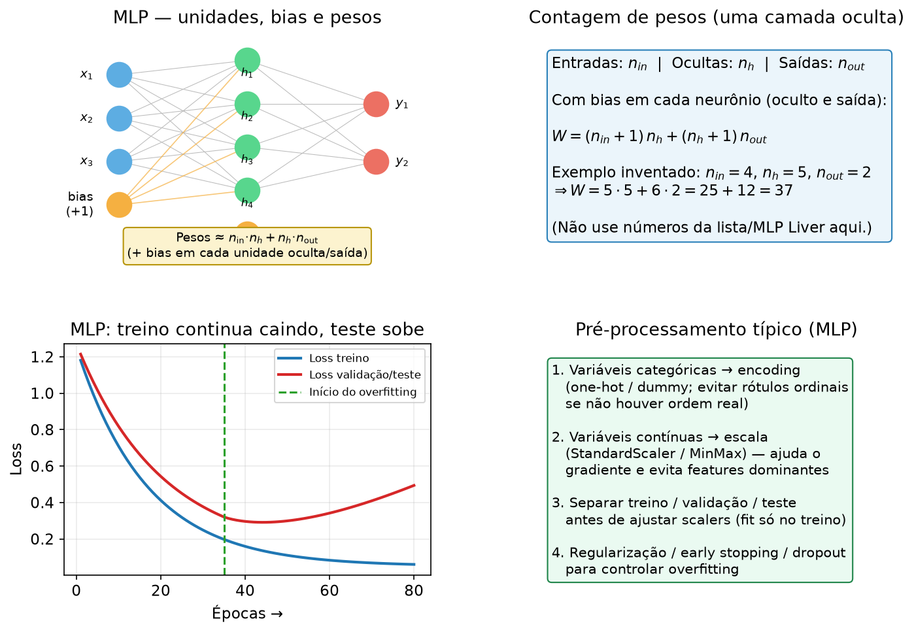

---

## 8. Gap treino × teste: o modelo decorou ou aprendeu?

### Imagem mental

Duas curvas vs. complexidade / épocas / tamanho da rede:

- Treino sobe (erro desce) quase sempre.
- Teste sobe e **pode cair** depois — aí o gap abre.

Se treino ≈ 98% e teste ≈ 60%: clássico **overfitting** (variância). Medidas conceituais: menos neurônios, weight decay, early stopping, mais dados, dropout, poda (em árvores).

<video src="figures/manim/OverfitGap.mp4" controls width="720"></video>

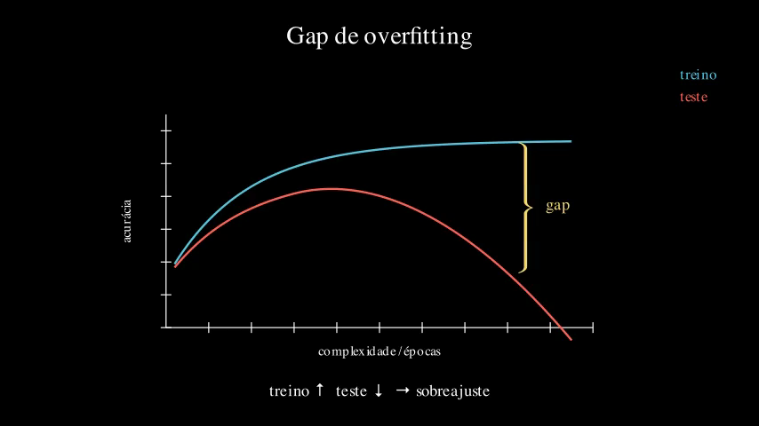

---

## 9. Ensemble — voto majoritário: democracia entre modelos

### Imagem mental

Três amigos chutam a classe; a maioria vence. Se os erros **não são perfeitamente correlacionados**, a chance de a maioria errar juntas cai.

$$
\hat{y} = \arg\max_{c} \sum_{t=1}^{T} \mathbf{1}\{h_t(\mathbf{x})=c\}.
$$

**Essência:** diversidade ajuda. Ensemble de clones idênticos não muda nada.

Bagging / florestas / boosting são variações dessa filosofia (agregar para estabilizar ou corrigir).

<video src="figures/manim/MajorityVote.mp4" controls width="720"></video>

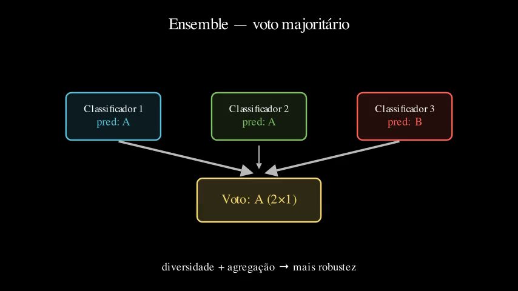

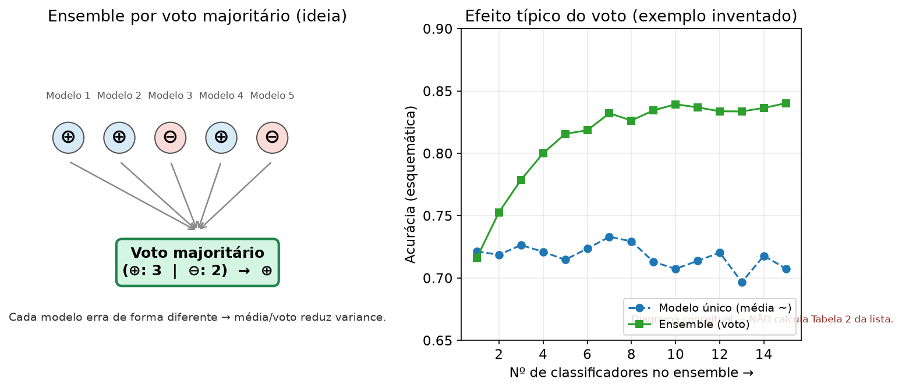

---

## 10. Checklist rápido antes da prova

- [ ] Sei explicar viés vs variância **sem** a fórmula, e depois escrever a fórmula.
- [ ] Consigo montar o produto Naive Bayes em 2–3 features (com log se necessário).
- [ ] Calculo $H$ de um nó pequeno e $\mathrm{IG}$ de um split de brinquedo.
- [ ] Sei o *porquê* da poda (não só a definição).
- [ ] Monto matriz de confusão e acurácia/erro a partir de preditos vs reais.
- [ ] Explico por que k-NN e MLP pedem escala.
- [ ] Conto pesos de uma MLP pequena (entradas × ocultos × saídas + biases).
- [ ] Reconheço overfitting pelo gap e cito 2–3 remédios.
- [ ] Faço voto majoritário em uma tabelinha inventada.

---

## Como re-renderizar Manim

Ver [README.md](README.md). Com o venv da **raiz** do repo:

```bash
source ../../../../.venv/bin/activate
./render_all.sh
# ou: manim -qm scenes.py BiasVariance
```

---

## Atribuição

Material de estudo para revisão de conceitos.  
*Formatação, estrutura didática e geração de figuras/animações com assistência de IA.*
